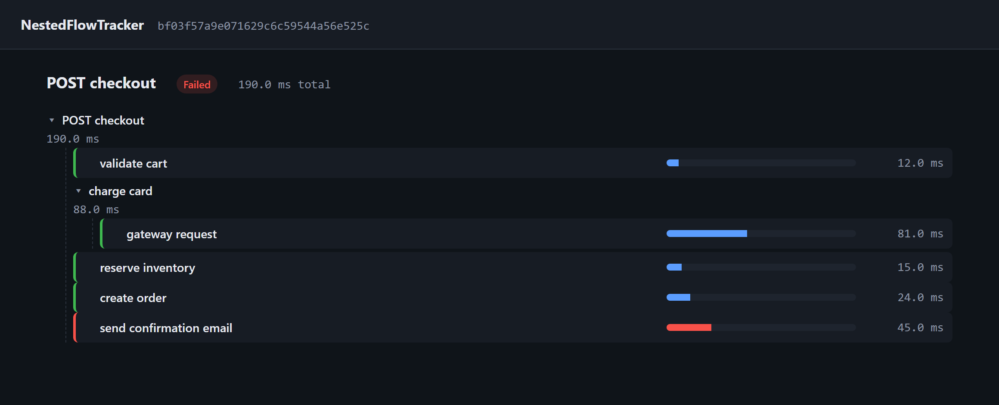
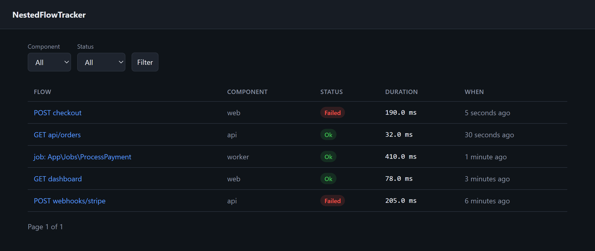

# NestedFlowTracker

[![Latest Version on Packagist][ico-version]][link-packagist]
[![Total Downloads][ico-downloads]][link-downloads]

The **zero-infra flow tracer for Laravel**. Wrap any block of code in a *span*; it gets timed and
stored as a tree in your own database, with nested sub-operations recorded as children. A single
flow can span multiple applications via a shared `trace_id`.

No collectors, no external backend — unlike OpenTelemetry you need no infrastructure, and unlike
Telescope it traces *your* business flows (not framework internals) and works in production.



> **Status:** 2.0 is under active development. The span API, auto-instrumentation, and the built-in
> viewer (above) are in; W3C Trace Context propagation and OpenTelemetry export are on the
> [roadmap](ROADMAP.md).

## Installation

```bash
composer require adelinferaru/nestedflowtracker
```

Publish and run the migration:

```bash
php artisan vendor:publish --tag="flow-migrations"
php artisan migrate
```

Optionally publish the config:

```bash
php artisan vendor:publish --tag="flow-config"
```

## Usage

The recommended API is `span()`: it opens a span, runs your callback, and closes it automatically —
even if the callback throws. It returns the callback's value untouched.

```php
use AdelinFeraru\NestedFlowTracker\Facades\Flow;

$account = Flow::span('register user', function () use ($data) {
    $account = Flow::span('create account', fn () => Account::create($data));

    Flow::span('send welcome email', fn () => Mail::to($account)->send(new Welcome()));

    return $account;
});
```

This records a tree:

```
register user .................. 142ms
├─ create account .............. 38ms
└─ send welcome email .......... 95ms
```

You can also use the `flow()` helper or resolve the service from the container:

```php
flow()->span('charge card', fn () => $gateway->charge($card));

app(\AdelinFeraru\NestedFlowTracker\FlowTracker::class)->span(/* ... */);
```

### Enriching a span

The open span is passed to your callback:

```php
Flow::span('import csv', function ($span) use ($rows) {
    $span->context = ['rows' => count($rows)];
    $imported = $this->import($rows);
    $span->result = ['imported' => $imported];
    return $imported;
});
```

### Manual spans

When you cannot wrap the work in a closure, open and close spans manually (LIFO — the innermost
open span is closed first):

```php
Flow::start('long running process');
// ...
Flow::end(['result' => ['ok' => true]]);
```

### Across applications (W3C Trace Context)

Flows propagate across services via the standard [`traceparent`](https://www.w3.org/TR/trace-context/)
header (our `trace_id` is already a 32-hex W3C trace id).

**Outbound** — add the current trace to an HTTP client call:

```php
Http::withFlowTrace()->post('https://orders.internal/checkout', $payload);
```

**Inbound** — with `flow.auto.http` enabled, an incoming `traceparent` is read automatically and the
request's root span continues the upstream trace. Doing it manually:

```php
use AdelinFeraru\NestedFlowTracker\TraceContext;

if ($ctx = TraceContext::parse($request->header('traceparent'))) {
    Flow::setTraceId($ctx->traceId);
}
```

## Artisan commands

```bash
php artisan flow:show {trace}   # print a flow as a tree
php artisan flow:prune --days=30 # delete flow spans older than N days
```

### Events

`SpanStarted` and `SpanFinished` are dispatched as spans open and close, so you can react to them
(e.g. log slow spans):

```php
use AdelinFeraru\NestedFlowTracker\Events\SpanFinished;

Event::listen(function (SpanFinished $event) {
    if ($event->span->duration > 1.0) {
        Log::warning("Slow span: {$event->span->name} ({$event->span->duration}s)");
    }
});
```

### Automatic instrumentation

Opt in to record spans with **zero manual calls**:

```dotenv
FLOW_AUTO_HTTP=true    # a root span per HTTP request (web + api groups)
FLOW_AUTO_QUEUE=true   # a root span per queued job
```

- **HTTP:** every request gets a root span named like `GET users/{id}`, with the method, path and
  response status in its context; it's marked `failed` on a 5xx response or an exception. Any
  manual `Flow::span()` calls during the request automatically nest underneath it.
- **Queue:** every processed job gets a root span (`job: App\Jobs\...`); failed jobs are recorded
  as `failed`. Each job is an isolated trace.

Both default to off, so installing the package never silently writes spans.

## Viewer

A small built-in UI to browse recorded flows as timed trees — no build step, no assets to compile.
Enable it and visit `/flow`:

```dotenv
FLOW_VIEWER=true
```

- **Index** (`/flow`) — recent flows with their component, status and duration; filter by
  component/status.
- **Detail** (`/flow/{trace}`) — the flow rendered as a collapsible tree with duration bars and
  failed spans highlighted.



**Access control:** the viewer is reachable automatically in the `local` environment. In any other
environment you must define a `viewFlow` gate to grant access:

```php
use Illuminate\Support\Facades\Gate;

Gate::define('viewFlow', fn ($user) => $user->isAdmin());
```

Publish the views to customize them: `php artisan vendor:publish --tag="flow-views"`.

## Configuration

| Env | Config key | Default | Description |
| --- | --- | --- | --- |
| `FLOW_ENABLED` | `flow.enabled` | `true` | Master switch. When off, `span()` runs your callback transparently and stores nothing. |
| `FLOW_COMPONENT` | `flow.component` | `app` | Name of this application/service, stored on every span. |
| `FLOW_CONNECTION` | `flow.connection` | `null` | Connection for the `flow_spans` table (null = default). |
| `FLOW_AUTO_HTTP` | `flow.auto.http` | `false` | Auto root span per HTTP request. |
| `FLOW_AUTO_QUEUE` | `flow.auto.queue` | `false` | Auto root span per queued job. |
| `FLOW_VIEWER` | `flow.viewer.enabled` | `false` | Register the built-in viewer routes. |
| `FLOW_VIEWER_PATH` | `flow.viewer.path` | `flow` | URL prefix for the viewer. |

## Testing

```bash
composer test
composer analyse
```

## Credits

- [Feraru Ioan Adelin][link-author]
- [All Contributors][link-contributors]

## License

MIT. Please see the [license file](license.md) for more information.

[ico-version]: https://img.shields.io/packagist/v/adelinferaru/nestedflowtracker.svg?style=flat-square
[ico-downloads]: https://img.shields.io/packagist/dt/adelinferaru/nestedflowtracker.svg?style=flat-square

[link-packagist]: https://packagist.org/packages/adelinferaru/nestedflowtracker
[link-downloads]: https://packagist.org/packages/adelinferaru/nestedflowtracker
[link-author]: https://github.com/adelinferaru
[link-contributors]: ../../contributors
